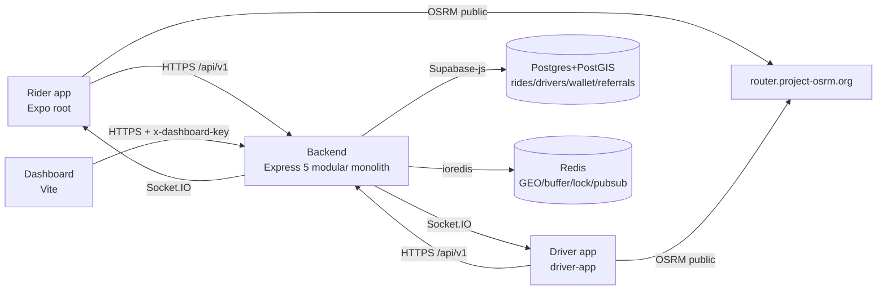

# Veylos (RideWay) — Architecture

> Codebase source of truth as inspected. Repo root hosts the rider app; `driver-app/`, `backend/`, `velos-dashboard/`, `supabase/` are sibling packages. Name "Veylos" in task = "RideWay" in code.

## Executive summary

- **What is Veylos?** Ride-hailing platform: rider mobile app (Expo, root), driver mobile app (`driver-app/`), Node backend (`backend/`), operations dashboard (`velos-dashboard/`), Supabase Postgres+PostGIS.
- **Major applications:** rider (`rideway-rider`, Expo ~54.0.33 / RN 0.81.5 / expo-router ~6.0.23), driver (`driver-app`, same Expo/RN + `react-native-qrcode-svg@6.3.22`), backend (Node 24, Express 5, Socket.IO 4, ioredis 5), dashboard (Vite+React).
- **Backend architecture:** modular monolith (`backend/src/modules/{driver,ride,matching,wallet,notification,referral,dashboard}` + `core/{database,redis,socket,middleware,logger}`). Controller → Service → Repository → Supabase/Redis. Entry `backend/src/server.js`, routes mounted in `backend/src/app.js`.
- **Authoritative store:** PostgreSQL `rides.status` for lifecycle; `drivers` for driver identity; `drivers.wallet_balance` + `wallet_transactions` for money. Redis is ephemeral (matching buffer, GEO, locks, pub/sub) — never lifecycle authority.
- **Matching:** rider `POST /rides/request` → Postgres idempotent row + Redis `ride:request:<id>` (TTL 120s) → GEO `drivers:online` radius 3000m + vehicle filter → `ride:offers:<id>` → `ride:notifications` pub/sub → Socket.IO `ride:request` to `driver:<id>` rooms. Accept uses Redis `SET NX EX 10` + Postgres `accept_ride_atomic (FOR UPDATE)` — exactly one winner.
- **Realtime:** Socket.IO with Supabase-JWT handshake (`core/socket/socket.js:15-31`), rooms `driver:<uid>` + `rider:<uid>`. Events: `ride:request` (→drivers), `ride:status_changed {rideId,status,ride}` (→rider, and driver on generic transitions). Supabase Realtime (`rideAPI.subscribeToRideUpdates`) supplements driver updates. Sockets are acceleration only; `GET /rides/{rider,driver}/active` is authoritative recovery.
- **Navigation:** OSRM public instance (`services/osrm.ts`, `driver-app/services/osrmNavigation.ts`), `react-native-maps`, `navigationStore` (ephemeral) + `useNavigationEngine` (fetch, off-route 120m, reroute ≥15s). Fresh route from current GPS on recovery; never persisted geometry.
- **Recovery:** Zustand `persist` (AsyncStorage) keeps minimal snapshot; launch/foreground/socket-reconnect reconcile via active-ride endpoints; `transition_ride_status` RPC is idempotent; duplicate completion cannot double-reward.
- **Major risks:** client-computed fare persisted verbatim (backend never recomputes); live DB must have migrations 006+007 applied or backend runs in JS-fallback mode; Redis outage degrades matching but not lifecycle; `PUT /drivers/offline` routes to `setOnline` handler (copy-paste, works by flag).

## Implementation status

- ✅ IMPLEMENTED: ride lifecycle RPCs, idempotent create/accept, active-ride recovery both apps, driver startup gate, referral driver→rider with atomic reward, wallet read paths, KYC review, dashboard read paths.
- ⚠️ PARTIALLY: wallet write paths (no `POST /wallet/recharge` in code; controller is read-only), dashboard operations map (mock data), `PUT /drivers/offline` handler reuse.
- 📝 PLANNED ONLY: `backend` `shared/`, `workers/`, `auth/rider/maps/profile/admin` modules (CONTEXT.md future phases); `GET /route` OSRM backend endpoint referenced in docs but absent from `ride.routes.js`.
- ❓ NEEDS VERIFICATION: live DB migration state (006/007 applied?), production `velos.app/r/:code` DNS vs backend `/r/:code` redirect.

See `architecture/` for detail, `DOCUMENTATION-AUDIT.md` for discrepancies.
