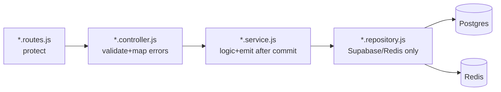

# Backend Architecture

- Runtime: Node 24, Express 5, CommonJS (`backend/package.json:23` express `^5.0.1`, socket.io `^4.8.3`, ioredis `^5.5.0`, supabase-js `^2.48.2`).
- Entry: `src/server.js` → `src/app.js` (cors, json, `correlationMiddleware`, request log `stage 1`, mounts `/api/v1/{drivers,rides,wallet,dashboard,referrals}`, `GET /r/:code`, `GET /health`).
- Layers: routes → controller → service → repository → Supabase/Redis. Repositories own all I/O; services hold business logic + socket emit after commit.
- Auth: `core/middleware/auth.middleware.js` (Bearer → `supabaseAdmin.auth.getUser` → `req.user`). All ride/driver/wallet/referral routes use `protect`. Dashboard uses `x-dashboard-key` (`dashboard.routes.js:24-32`).
- Validation: inline in controllers (status whitelists, vehicle types); no shared validator lib.
- Errors: `{ error: message }` with 400/403/404/409/422/500 mapping (ride controller maps RPC `P0001→409`, `42501→403`, not-found→404).
- Logging: winston `core/logger/logger.js` (`stage`, `track`, ALS correlation id via `correlation.middleware.js`).
- Modules:
  - `driver/`: profile/register/docs/location/online/offline/nearby.
  - `ride/`: lifecycle (`ride.lifecycle.js` TRANSITIONS) + active/history; delegates create/accept to matching.
  - `matching/`: `createRideRequest` (idempotent row → Redis buffer → candidates → rank → offers), `acceptRide` (lock → RPC → cleanup).
  - `wallet/`: read-only (`GET /:userId/balance|transactions` via `get_balance` RPC + direct select).
  - `notification/`: Redis `ride:notifications` → Socket.IO `ride:request`.
  - `referral/`: code/apply/history/stats + `tryRewardForRide` hook from `ride.service completeRide`.
  - `dashboard/`: stats/rides/drivers/KYC review.

- ✅ IMPLEMENTED modular monolith + correlation logging.
- ⚠️ Wallet writes absent; `PUT /drivers/offline → setOnline` alias.
