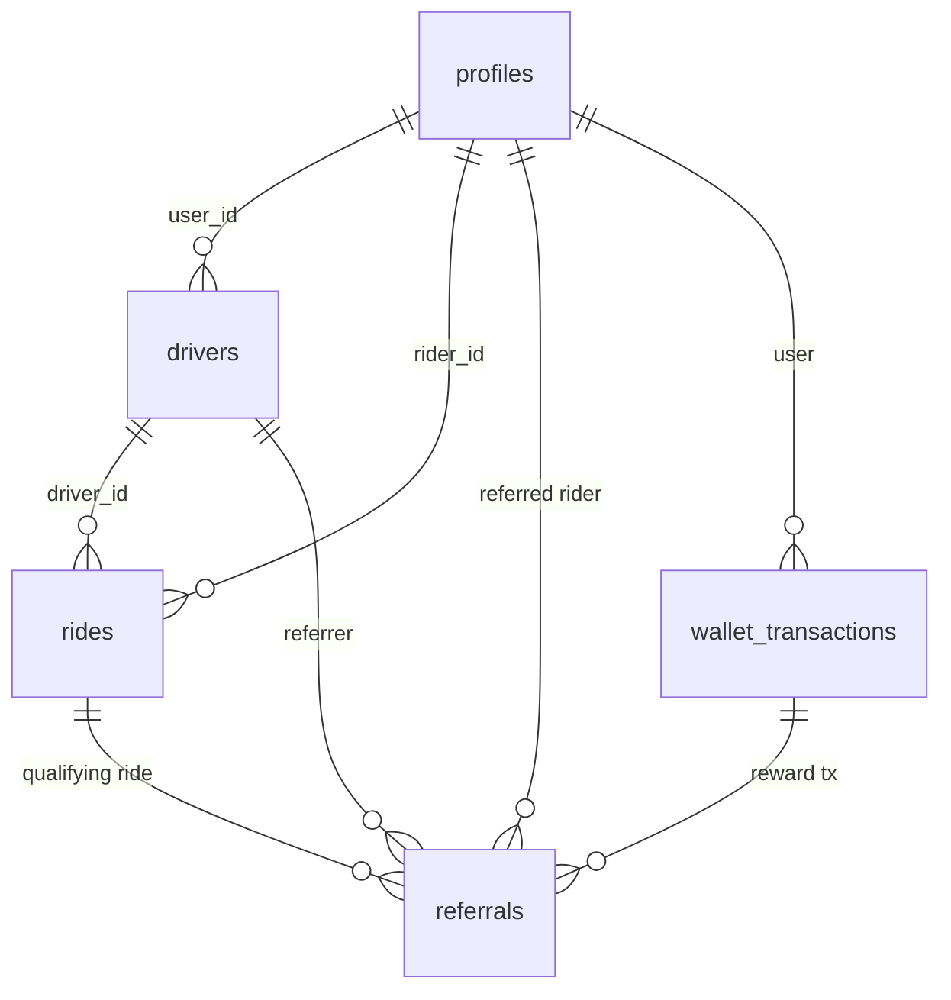

# Database Architecture (Supabase Postgres + PostGIS)

## Enums (`backend/supabase_schema.sql:9-10`, `007` adds `referral_reward`)

`user_role(rider,driver,admin)`, `vehicle_type(bike,mini,sedan,shuttle)`, `ride_status(IDLE,REQUESTED,SEARCHING_DRIVER,DRIVER_ASSIGNED,DRIVER_ARRIVING,RIDE_STARTED,RIDE_COMPLETED,CANCELLED)`, `transaction_type(credit,debit[,referral_reward])`, `payment_status`, `kyc_status`, `document_status`.

## Tables

- `profiles(id PK→auth.users, name, phone UNIQUE, role, avatar_url)`: source of truth for user identity. Written by `handle_new_user` trigger. Read by matching (rider name), referral (rider exists/role).
- `drivers(id PK=user_id, user_id UNIQUE→profiles, vehicle_type, vehicle_number, …, is_online, kyc_status, is_verified, wallet_balance, location GEOGRAPHY, referral_code UNIQUE)`: source of truth for driver identity/eligibility/balance/referral code. `referral_code VEL-XXXXX` via `generate_referral_code()` + trigger (`007:9-37`) + backfill.
- `rides(id PK, rider_id→profiles, driver_id→drivers NULL until accept, pickup/drop GEOGRAPHY NOT NULL + address TEXT, fare/distance/duration NUMERIC, status, idempotency_key, version=1, assigned/arrived/started/completed/cancelled_at, created/updated_at)`: **authoritative lifecycle store**. Mutated only via RPCs `create_ride_idempotent / accept_ride_atomic / transition_ride_status / accept_ride` (006). Indexes: `idx_rides_idempotency UNIQUE(rider_id,key) WHERE key NOT NULL`, `idx_rides_rider/driver_active` partials, drivers GIST location.
- `wallet_transactions(id, user_id→profiles, ride_id→rides, amount, type, description)`: ledger. Referral reward inserts `credit` (spec planned `referral_reward` enum; implementation uses `credit` — see audit).
- `referrals(id, referrer_driver_id→drivers, referred_rider_id→profiles, referral_code, status pending|qualified|rewarded|rejected|expired, qualifying_ride_id→rides UNIQUE WHERE NOT NULL, reward_amount, reward_transaction_id→wallet_transactions, created/qualified/rewarded/expires_at)`: source of truth for attribution. Uniques: one active (`pending|qualified|rewarded`) per rider; one referral per qualifying ride.
- `driver_documents`, `driver_kyc_reviews`, `payments`, `ratings`: KYC/audit/payments/feedback.

## Ownership / consistency

- Rides: backend RPCs only (row lock `FOR UPDATE`, version+1, server `NOW()` timestamps). Clients request, server decides.
- Drivers: `drivers` row authoritative for eligibility (`vehicle_type`), balance, referral code.
- Wallet: `drivers.wallet_balance` + ledger must move together inside `try_reward_referral` transaction.

- ✅ Migration chain `supabase/migrations/001-006` + `backend/supabase/migrations/006_kyc_review, 007_referral`.
- ⚠️ `007` enum intent vs implementation (see audit).
