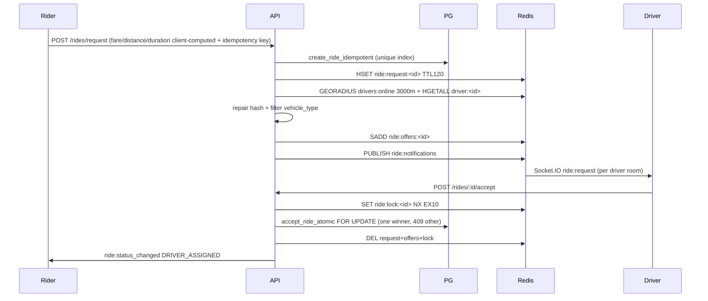

# Matching Architecture (`backend/src/modules/matching/`)

Pipeline: `matching.service.createRideRequest` → `candidate-finder` → `candidate-ranker` (identity today) → `offer-dispatcher` → `acceptance-manager`.

- Candidate discovery: `getNearbyDrivers(lat,lng,3000)` → repair-at-read `repairDriverMetadata` (UUID-guarded, from `drivers` row) → exact `vehicle_type` match.
- Offer: `addDriversToQueue` + `getRiderName` + `publishNotification` with `expiresAt = now + 120000`.
- Accept races: Redis lock reduces stampede; Postgres `FOR UPDATE` decides; same-driver retry idempotent; different-driver → 409.
- PostGIS `get_nearby_drivers` RPC exists in schema but matching uses Redis GEO in code (discrepancy — see audit).

✅ IMPLEMENTED. ⚠️ Ranker is pass-through; `candidateCount` may be 0 with no retry.
