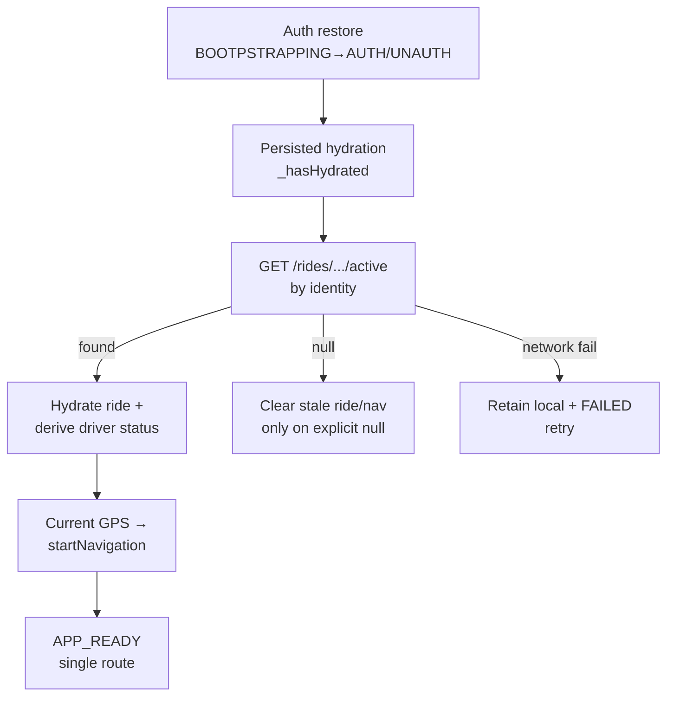

# Reliability & Recovery

- Rider: `persist rider-ride-storage` + `useRideRecovery` (launch/5s/foreground) + socket reconnect hydrate; mismatch guard; no IDLE reset on transient fail.
- Driver: startup gate (`StartupGate`), `reconcileRideOnce` (identity, in-flight mutex), `recoverNavigationFromRide` (GPS-first), `RideStatusCard` recovering state, single `router.replace`.
- Idempotency: `create_ride_idempotent` (unique index), `accept_ride_atomic`, `transition_ride_status` (same-status no-op, `COALESCE` timestamps, `version+1`), referral `try_reward_referral` (unique qualifying ride).
- Redis down / backend restart: lifecycle still correct via Postgres; matching pauses; sockets reconnect → reconcile.

✅ IMPLEMENTED. See `flows/failure-recovery-flow.md`.
