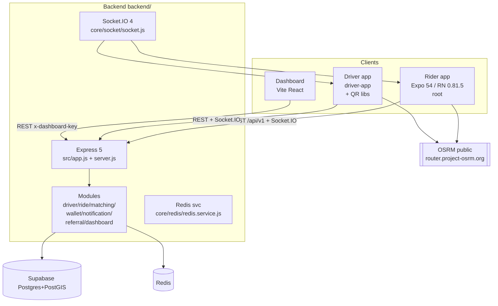

# System Architecture

## Runtime / deployment

- Backend: Node 24 CommonJS, `npm start → node src/server.js` (`backend/package.json:6`). Env `backend/.env` (Supabase URL/keys, Redis host/port, PORT 3000, OSRM base). No Dockerfile in repo. ❓ deployment target unverified.
- Rider/driver: Expo Go / dev builds; schemes `ridewayrider` (rider `app.json:7`), driver `driver-app/app.json`. Referral landing `GET /r/:code` (`backend/src/app.js:34-42`) redirects to `ridewayrider://r/<code>`.
- Dashboard: Vite, `VITE_API_BASE_URL ?? http://localhost:3000/api/v1` (`velos-dashboard/src/lib/apiClient.ts:1-2`).

## Module boundaries

`backend/src/modules/*`: each owns routes+controller+service+repository, exported via `index.js` (`CONTEXT.md:42-55`). `core/` holds DB/Redis/socket/middleware/logger only. ✅ IMPLEMENTED.

## Status

- ✅ Backend modular monolith, Socket.IO, Redis GEO/pub/sub, Supabase clients.
- ⚠️ Backend wallet writes, dashboard ops map (mock), `PUT /drivers/offline` handler alias.
- ❓ Docker/deploy, production `velos.app` wiring.
