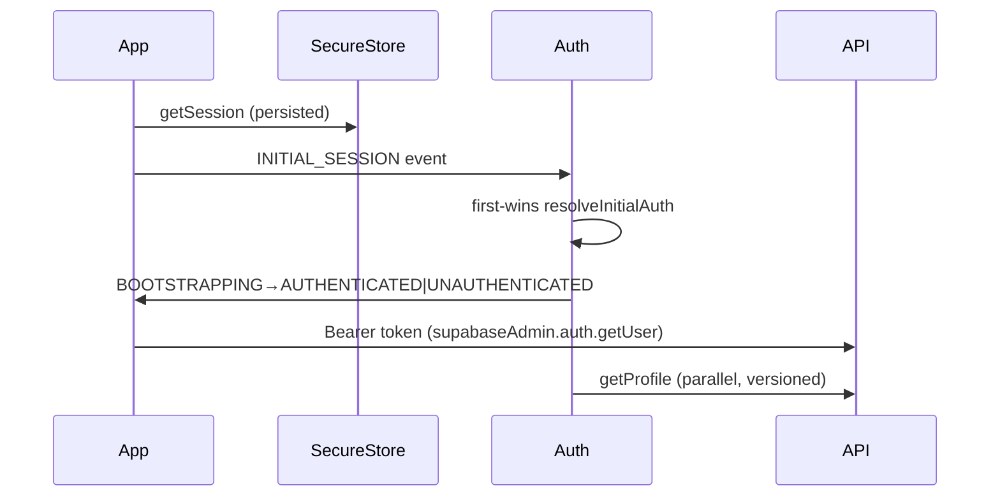

# Authentication Flow

- Rider: `context/auth-context` + token mirror `supabase_token`; gating unauth→Login, no-name→ProfileCreation.
- Driver: tri-state + `StartupGate` + `StartupSplashGate`; `TOKEN_REFRESHED` never re-enters BOOTSTRAPPING; `home` respects `authState`.
- Dashboard: `x-dashboard-key` vs `DASHBOARD_API_KEY`.
- ✅ IMPLEMENTED.
