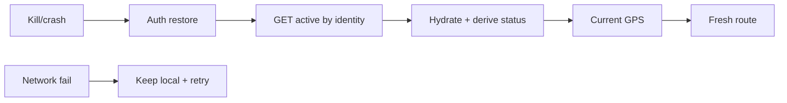

# Failure & Recovery Flow

| Scenario | PG state | Redis | Survivor | Reconnect/hydrate | Idempotent? |
|---|---|---|---|---|---|
| Rider kill SEARCHING | row SEARCHING (if migration applied) else none | `ride:request` TTL120 | persist snapshot | `GET /rides/rider/active` → hydrate | create same key → same ride |
| Rider kill ASSIGNED/ARRIVING/STARTED | row + status | — | snapshot | active endpoint → hydrate; socket reconnect hydrate | — |
| Driver kill navigating | row ASSIGNED/ARRIVING/STARTED | GEO may expire | driver status + ride snapshot (nav not persisted) | startup gate → `GET /rides/driver/active` → derive status → GPS → `startNavigation` → route screen | accept/complete repeat safe |
| Storage cleared | row intact | — | nothing | identity query recovers | — |
| Network down at startup | row intact | unreachable | local | `FAILED` retains local, retry foreground | — |
| Socket drop | row intact | pub/sub missed | local | reconnect → active reconcile | events never regress terminal |
| Backend restart | PG intact | Redis lost (buffers/locks) | PG | clients reconcile; matching buffers expire | locks expire 10s |
| Redis down | PG intact | errors | PG | lifecycle via RPC; matching paused | — |

✅ IMPLEMENTED. See `architecture/reliability-recovery.md`.
