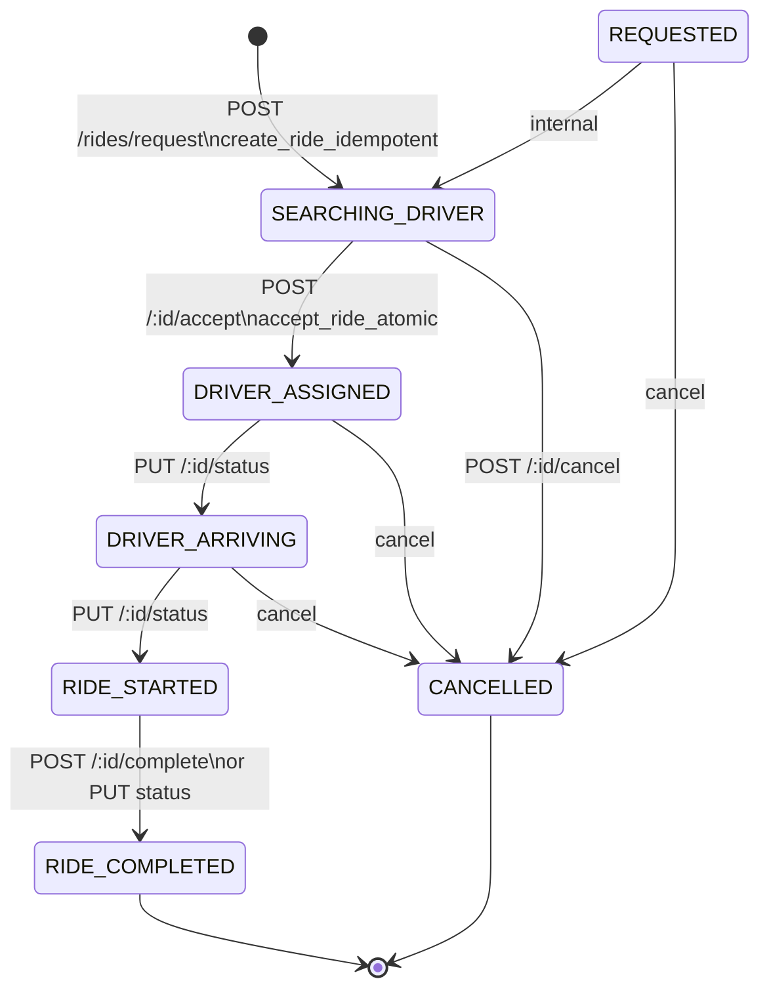

# Ride Lifecycle (authoritative)

Enum: `ride_status(IDLE,REQUESTED,SEARCHING_DRIVER,DRIVER_ASSIGNED,DRIVER_ARRIVING,RIDE_STARTED,RIDE_COMPLETED,CANCELLED)` (`backend/supabase_schema.sql:9`). Runtime map `backend/src/modules/ride/ride.lifecycle.js:11-20`.

| Transition | Trigger/client | Endpoint/service | DB | Redis | Event | Client result |
|---|---|---|---|---|---|---|
| →SEARCHING | rider confirm | `POST /request` → `matching.service` | `create_ride_idempotent` SEARCHING | `ride:request` TTL120 | — | `SEARCHING_DRIVER` |
| →ASSIGNED | driver accept | `POST /:id/accept` → `acceptance-manager` | `accept_ride_atomic FOR UPDATE` | lock+DEL buffer/queue | `ride:status_changed` | rider tracking, driver pickup-nav |
| →ARRIVING | driver arrived | `PUT /:id/status DRIVER_ARRIVING` | `transition_ride_status` | — | `ride:status_changed` | arrived state |
| →STARTED | driver start | `PUT … RIDE_STARTED` | RPC + `started_at` | — | event | drop-nav |
| →COMPLETED | driver complete | `POST …/complete` or `PUT` | RPC + `completed_at` + referral hook | — | event | receipt/earnings |
| →CANCELLED | rider/driver | `POST …/cancel` | RPC + `cancelled_at` | DEL buffer | event | idle |

Same-status repeat = no-op (no timestamp/version bump). Terminal immutable. Actor-checked (post-assignment driver-only except cancel). ✅ IMPLEMENTED.
